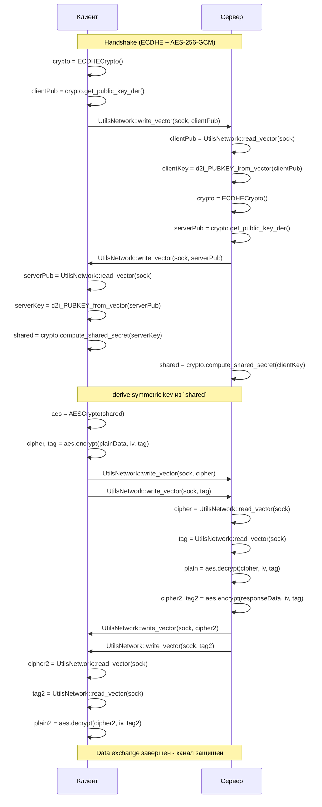

## Схема обмена TLS 1.3 (упрощённо, на основе RFC 8446)

**Пояснения:**
1. **ECDHECrypto** — обмен ключами: генерация пары (приватный/публичный), сериализация через DER и передача функциями `UtilsNetwork`.
2. **compute_shared_secret** — вычисление общего секрета на основе ключей сторон.
3. **AESCrypto** — инициализация AES-256-GCM, шифрование (`encrypt`) и дешифрование (`decrypt`).
4. **UtilsNetwork** — сетевые утилиты для сериализации/десериализации вектора байт подряд: `write_vector`/`read_vector`.

Эта диаграмма близка к обмену сообщениями TLS 1.3 (RFC 8446), адаптированная к используемым в проекте функциям.
